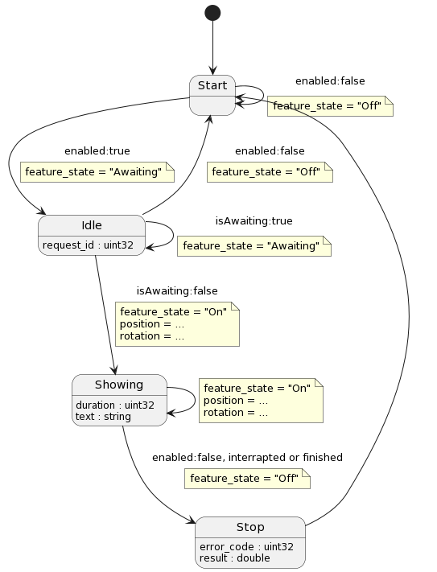

# state-machine-light
Our intention is to reflect UML statechart notation as directly as possible into the code, like as



```cpp
struct Start {
    using Transition = OneOf<Start, Idle>;
};

struct Idle {
    using Transition = OneOf<Start, Showing, Idle>;

    std::uint32_t request_id;
};

struct Showing {
    using Transition = OneOf<Showing, Stop>;

    std::uint32_t duration;
    std::string text;
};

struct Stop {
    using Transition = OneOf<Start>;

    std::uint32_t error_code;
    double  result;
};

using StateType = OneOf<Start, Idle, Showing, Stop>;
```
